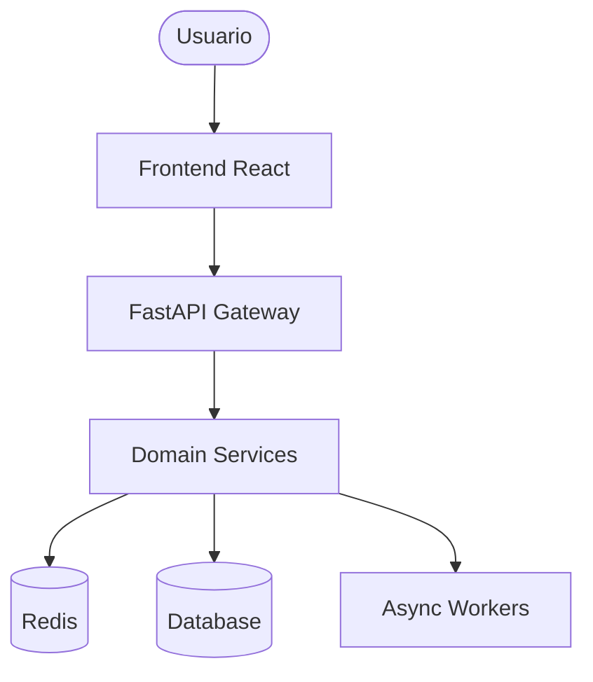

# Día 30: DEMO Final y Entrega del Proyecto

¡Misión Cumplida! El proyecto **Subscription Manager** está finalizado y listo para ser presentado.

## Resumen del Proyecto

Se ha construido un MVP Fullstack (FastAPI + React) que resuelve la gestión de cobros recurrentes con un enfoque en UX Senior y arquitectura limpia.

### Componentes Clave:

1.  **Backend Robustez**:
    -   FastAPI con Clean Architecture.
    -   Observabilidad y Structured Logging.
    -   Estrategia de caché con Redis.
    -   Cobertura de tests > 70%.
2.  **Frontend Premium**:
    -   React + TanStack Query para manejo de estado.
    -   Dashboard de visualización de gastos.
    -   Optimización de flujo de registro (Auto-login).

## Diagrama de Arquitectura Final

## Conclusión del Reto

Este proyecto demuestra la capacidad de actuar como un **Engineer T-Shaped**, dominando desde la infraestructura (Docker, Observabilidad) hasta la lógica de negocio y la experiencia de usuario.

---
**Proyecto finalizado en el Reto de 30 Días.**
